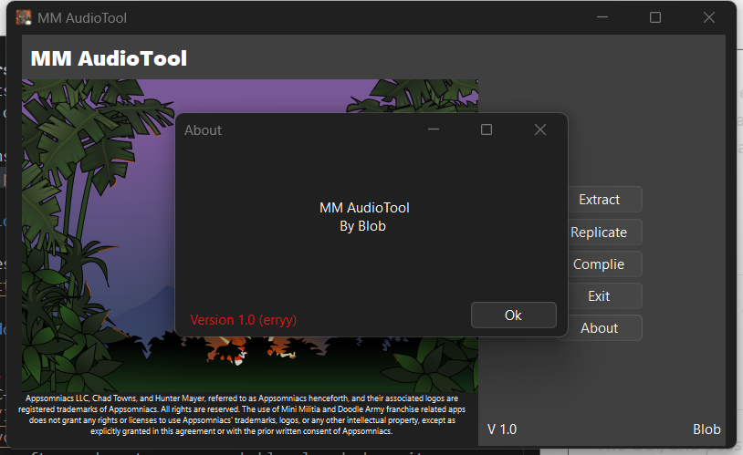

**MM AudioTool** is a tool used to modify sound effects from [Appsomiacs](https://www.appsomniacs.com/) Mini Milita Series, It uses [cktool](https://github.com/sjmerel/ck) to make this possible

## Download

The latest version of MM AudioTool can be downloaded from [the releases page](https://github.com/Blob43/MM-AudioTool/releases).

### Windows

Requires [.NET 8.0](https://dotnet.microsoft.com/en-us/download/dotnet/8.0). You probably already have it installed, but if you get an error about .NET, you need to install it.

### Credits
[Cricket Audio](https://github.com/sjmerel/ck) for making this all possible
